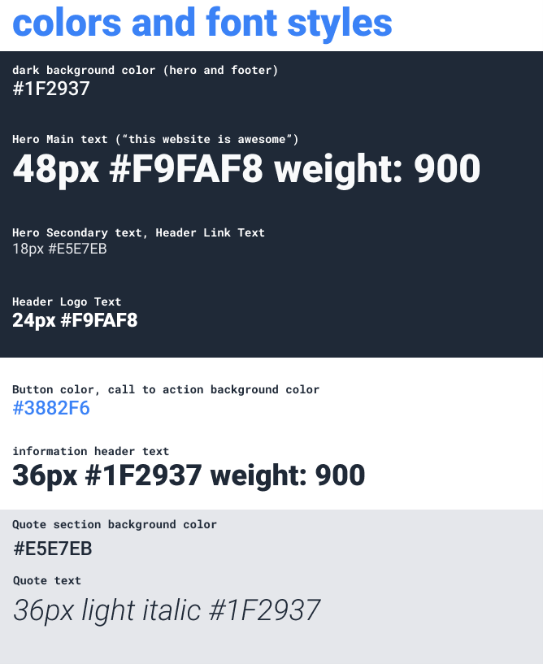
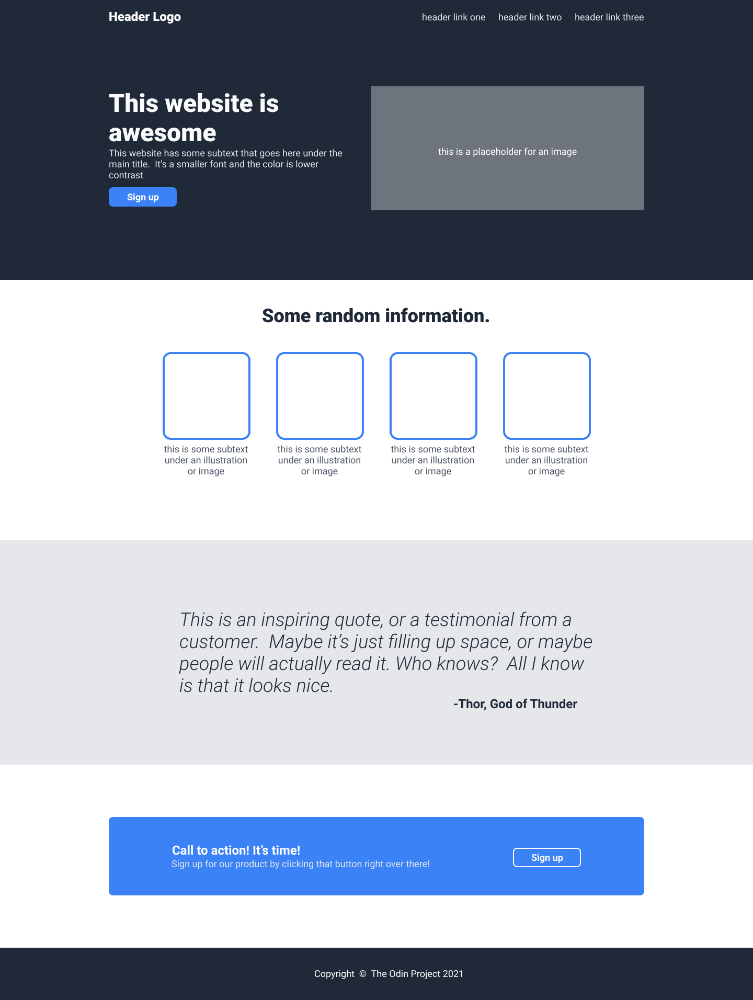
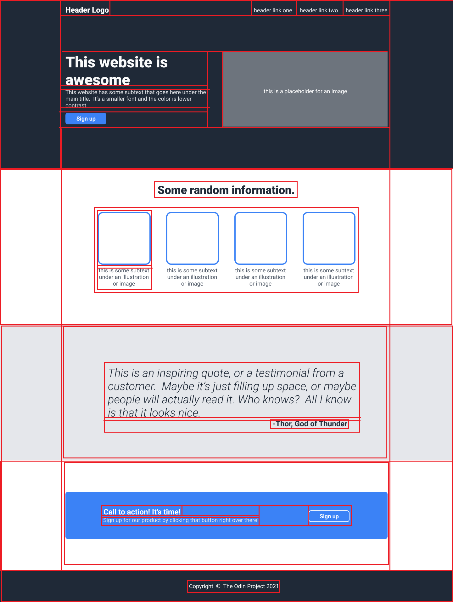

# TOP-Landing-Page
Last exercise of flexbox from The Odin Project: https://www.theodinproject.com/lessons/foundations-landing-page

For this project you’ll be creating an entire web page from a design we’ll provide for you. If you’ve been following along you should have the skills you need to accomplish this, but it may not be easy!

The design we’re providing you comes in the form of 2 images: one is an image of the complete website, and one has some details about some of the fonts and colors we’ve used.

### Setting up your project’s GitHub repository
As we did in the Recipes project, go ahead and set up a git repository before beginning work on this project. Git and GitHub are going to act as a portfolio for you moving forward, so you need to keep everything in there! Look back at the Recipes project if you need a reminder on how to set it up

> ### A note about images on the web
> You do not have the legal right to use just any image that you find on the web. There are many free images to be found, but make sure that the image you use is actually free for you to use, and make sure to credit the creator of the image in your project. An easy way to give credit is to put the creator’s name and contact info in a README file in your repository.
Some good places to find free-to-use images on the web include Pexels, Pixabay, and Unsplash.

## Asignment
Don’t forget to commit early & often! You can reference the Commit Message lesson!

1. Download the design images and take a look at what you’re going to be creating  1.2 here. Image One (Full Design), Image Two (Color and Fonts)
   1. The font that’s being used in the images is Roboto.
   2. Hero text is the statement that appears at the top of a web page.

2. There are many ways to tackle a project like this, and it can be overwhelming to look at a blank HTML document and not know where to start. Our suggestion: take it one section at a time. The website you’re creating has 4 main sections (and a footer), so pick one and get it into pretty good shape before moving on. Starting at the top is always a solid plan.

3. For the section you’re working on, begin by getting all the content onto the page before beginning to style it. In other words, do the HTML and then do the CSS. You’ll probably have to go back to the HTML once you start styling, but bouncing back and forth from the beginning will take more time and may cause more frustration. (Note: you don’t need to use more than one stylesheet. Using only one CSS file is adequate for this project).

4. Many of the elements on this page are very similar to things you saw in our flexbox exercises… feel free to go back to those if you need a refresher.

5. Do not worry about making your project look nice on a mobile device. We’ll learn that later.

6. When you finish, don’t forget to push it up to GitHub!

## Fonts

## Desired Output

## Desired Output with my margins drawn 

To make more obviuous the styles I have to add, I edited the image of desired output in paint and added the borders that I imagine the elements have, this could be a little missleading because some of those borders will not end up in the end result (because they do not make sense, not because the end result is wrong) so take the borders with a pinch of salt.

